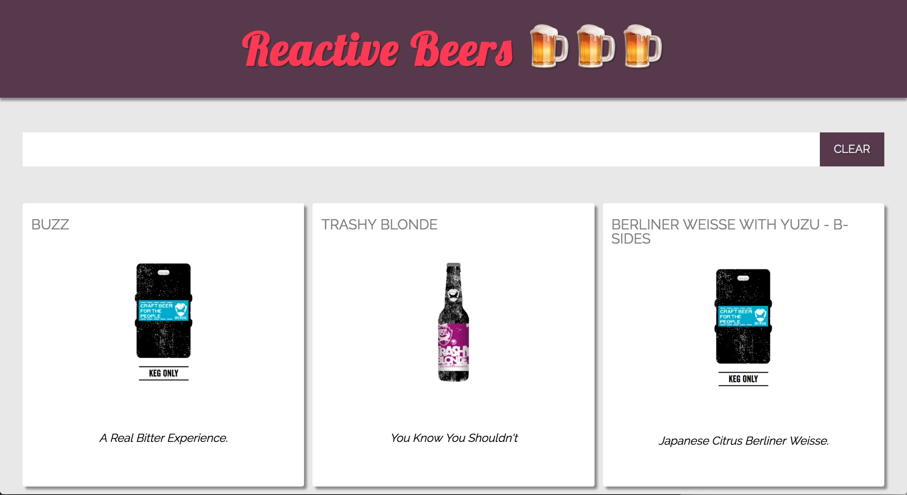

# Reactive Beers

This is my first project using React and Redux. I set up this little project to get some practical knowledge about the React/Redux ecosystem.

I must say, React + Redux = ❤️

It is so much fun to build views this way. It's really easy to maintain a clean codebase. Debugging is fun, bugs stay at a minimum and the world just becomes a better place ;)

## Lessons Learned

I included the following in the project:

* **Stateless, functional components**. Every react component is basically a function. No local state management inside a component. No lifecycle hooks.
* **Redux**: State is managed globally. State manipulation is done only by dispatching predefined actions. State is trickled down and available to the components when needed.
* **Async Actions**: I used a public API, [Punk API](https://punkapi.com/) to get some sample data. This required me to understand asynchronous state manipulation. Also, for testing the API needed to be mocked
* **Dev setup for Webpack to get Babel, React, Redux and SASS to play together nicely**

